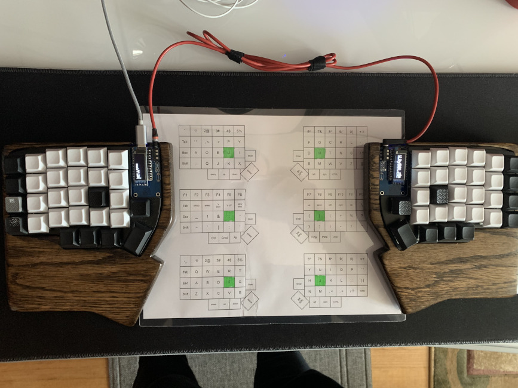
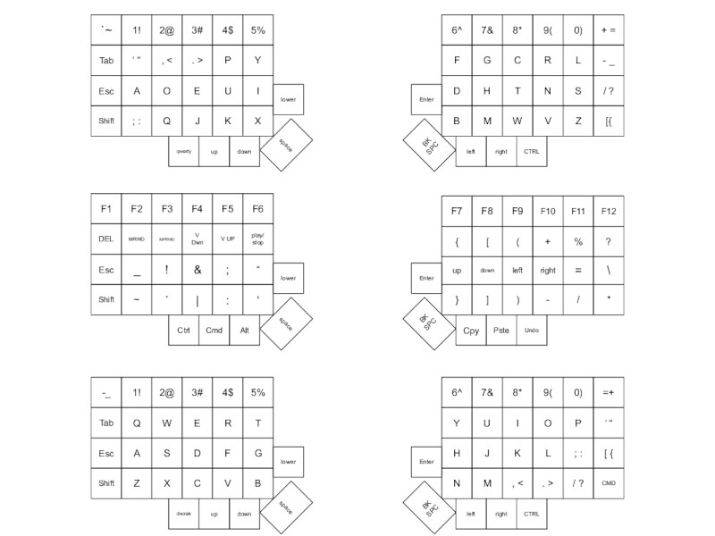

## Lily58Pro - KeyMap + OLED : Key logger + Lily58 Logo

-----
### Key maps :

1. Dvorak - Default Layer when plugged in
2. Special Keys - "Middle" Layer, activated only on key press + hold
3. Qwerty - Toggled on/off, here so while learning Dvorak the keyboard can still be used.

### About the Project
There are so many reasons why I decided on building my own keyboard I can spend a few hours on but here's the cliff notes :

- Qwerty Layout is ancient - it was designed for typewriters, not for the digital age. I got really tired of the inefficiency; high use keys are outside of the home row.

- Taking my key caps off and rearranging them is not only tedious and inefficient but also not fun. 

- Buying another keyboard is costly(not saying this isn't but I learned a few things along the way) and switching keyboards around is not my cup of tea. What if I don't like it ?

- Plug-n-Play - Changing the layouts on all of my computers is temporary(Reinstall OS, requires research, constantly changing settings).  - I wanted plug-n-play-call-it-a-day functionality. This removes mental overhead. 
 
- Ortho-Linear Physical Key Layout - I didn't buy into it at first. But this truly is a game changer. If you haven't tried a keyboard with a straight up and down layout. DO IT. Trust me you and your fingers/wrists will thank me later. - No more twisting, uncomfortable reaching for keys.

- Freedom to place things between the keyboard - I do a lot of note taking/writing, my cat likes to be directly in front of me no compromise. The split allows this to be comfortable and ergonomic. No more awkward angles/ trying to write things down, reaching across and over to the keyboard or having to move things around. 

- I wanted to combine my hobbies of woodworking, electronics, and programming. 

Also was my first experience writing C, embedded programming, etc.  
Wanted to see how fast I can pick up new technologies and make sense of existing code bases and make something functional with no compromise. 

## Installation 
 
 1. Clone QMK Repo : 
 
   `https://github.com/qmk/qmk_firmware` 

 2. Change Directory To:

`path/to/clonedQMK  /qmk_firmware/keyboard/lily58/keymaps`

 3. Clone this repo into the key maps directory(above step)
  
`git clone https://github.com/qmk/qmk_firmware.git`

 4. Change into this cloned repo's directory
 
 `cd Lily58_dvorak-spckys-qwerty`
 
 5. Run qmk flash: (Lily58 should be plugged in via usb on the left side and the left and right sides are plugged in together via TRRS cable)
 
 `qmk flash`

This is also assuming you are using elite-c micro controller + bootloader if you don't :

- Open rules.mk located in this cloned repository and remove:

`BOOTLOADER = atmel-dfu`

- Flash

` qmk flash `

- Follow prompt to reset

**Side Note**

Running qmk flash with no flags only works in this instance because you are currently in the directory you want to flash. 

Once flashing is complete. The right half(assuming you are using two micro controlllers :  should not have been plugged in while flashing via usb-c cable) won't work. No worries all that needs to be done is a quick flip of the usb-c cable from left side to the right side and back for just a seconds and it'll register itself as master(left) - slave(right)  

### Future For The Project 
****

+ OLED Covers
+ LED Back-lighting 
	* Custom lighting patterns
+ Possibly other key mapping layout changes - Depending on real world functionality of current
+ Logo redesign, possible generator for customization user specific

#### References + Useful Links 

**Parts** - Just about everything you might need, wish I found this before I actually did this keyboard
>https://keyhive.xyz/

**Build Guide** For anyone new to electronics and want to do a ***Lily58***
> https://github.com/kata0510/Lily58/blob/master/Pro/Doc/buildguide_en.md

**QMK** A dependency for the project - Has all the necessary build data to get this up and running. 
> https://github.com/qmk/qmk_firmware
> Place this repo in qmk_firmware/keyboard.lily58/kepmaps/